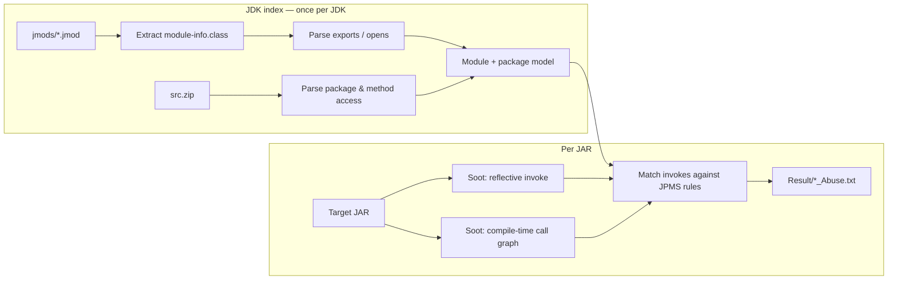

# BEAD

**Breaking Encapsulation Abuse Detector** — a static-analysis tool that finds Java libraries reaching into JDK internals they are not allowed to use after Java 9's module system (JPMS).

Java 9 sealed most `com.sun.*` / `sun.*` APIs behind `exports` / `opens` directives. Libraries that still call them — by name at compile time, or through reflection — fail at runtime with `IllegalAccessError`, or need a pile of `--add-exports` / `--add-opens` flags. BEAD tells you *which* calls break strong encapsulation, and *why*.

## Results

Evaluated on 9 real-world JARs against JDK 17. **201 encapsulation-abuse instances** (7 reflective, 194 compile-time). Full reports live in [`Result/`](Result/).

| Subject | Reflective | Compile-time | Total |
| --- | ---: | ---: | ---: |
| error_prone_check_api 2.5.1 | 2 | 117 | **119** |
| google-java-format 1.22.0 | 0 | 44 | **44** |
| darklaf-core 2.6.1 | 1 | 18 | **19** |
| checker-framework dataflow 3.32.0 | 0 | 6 | **6** |
| jvm-attach-api 1.5 | 1 | 4 | **5** |
| arthas-core 3.6.7 | 1 | 3 | **4** |
| lombok 1.18.6 | 0 | 2 | **2** |
| cglib 3.3.0 | 1 | 0 | **1** |
| flatlaf 3.4.1 | 1 | 0 | **1** |
| **Total** | **7** | **194** | **201** |

Example finding — cglib reflectively calling a `protected` JDK method:

```
Detected abuse under module java.base
Source method: <net.sf.cglib.core.ReflectUtils$1: java.lang.Object run()>
Involved Method: java.lang.ClassLoader.defineClass
Abuse Reason: The project tries to reflectively invoke this method, but
              java.lang.ClassLoader.defineClass is protected
```

## How it works



BEAD first builds a model of what the JDK actually exports and opens, plus each method's access modifier. It then uses [Soot](https://soot-oss.github.io/soot/) to recover reflective `getDeclaredMethod` / `invoke` sites and a compile-time call graph, and flags any call that would be illegal under strong encapsulation.

## Quick start

**Requires JDK 17** and Maven. Soot 4.5.0 cannot load class files from newer JDKs, and the numbers above were produced on JDK 17. The repo already includes a JDK 17 module/package index (`ModuleInfo.txt`, `PkgInfo.txt`) and the nine evaluation JARs under `TestJar/`.

```bash
git clone https://github.com/CyberSakura/BEAD.git
cd BEAD

# macOS
export JAVA_HOME=$(/usr/libexec/java_home -v 17)
export PATH="$JAVA_HOME/bin:$PATH"

mvn compile exec:java -Dexec.args="--jar TestJar/lombok-1.18.6.jar"
```

Reports are written to `Result/`:

- `lombok-1.18.6_Reflect_Abuse.txt`
- `lombok-1.18.6_Compile_Time_Abuse.txt`

Analyze any other JAR the same way:

```bash
mvn compile exec:java -Dexec.args="--jar /path/to/your.jar"
```

If Soot runs out of memory on a large JAR:

```bash
export MAVEN_OPTS="-Xmx4g"
```

Rebuild the JDK index (needed if you switch JDK versions):

```bash
mvn compile exec:java -Dexec.args="--jar TestJar/lombok-1.18.6.jar --rebuild-jdk-index"
```

`--jmods` defaults to `$JAVA_HOME/jmods`. `--src-zip` defaults to `./src.zip` if present, otherwise `$JAVA_HOME/lib/src.zip`.

```text
--jar <path>            JAR to analyze (required)
--jmods <dir>           JDK jmods directory
--src-zip <path>        JDK source zip
--rebuild-jdk-index     Rebuild ModuleInfo.txt / PkgInfo.txt from the JDK
```

## Project layout

```
src/main/java/Bead.java     single CLI entry — runs the pipeline
TestJar/                   evaluation JARs
Result/                    precomputed reports (and new runs)
directives/                extracted JPMS exports / opens
ModuleInfo.txt             JDK module access model
PkgInfo.txt                JDK package / method access model
```

`Bead` is the only class you need to run. The original per-stage classes (`ExtractModuleInfoClasses`, `ReflectionAnalyzer`, `AbuseAnalyzer`, …) are still there if you want to inspect or rerun one step.

Master's thesis project. Analysis logic is unchanged from the evaluation that produced the numbers above.
